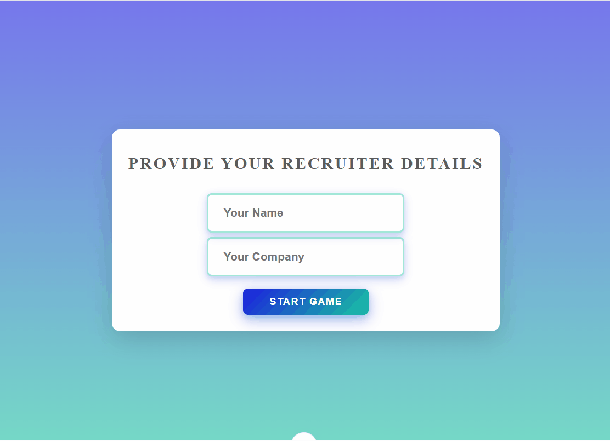

# Recruiter Questionnaire

## About the Project

When applying for jobs, not only my knowledge and skills matter, but also how well recruiters understand me as a candidate.  
To create a more comfortable and personal interview experience, I developed this web application that allows recruiters to get to know me better before or during the interview process.

The platform provides an interactive questionnaire experience designed to improve communication between recruiter and me.

---

## Tech Stack

### Frontend
- Vue.js

### Backend
- Spring Boot (Java)

### Database
- PostgreSQL

---

## Architecture & Implementation

The application was implemented using modern best practices of the respective frameworks.

Some key aspects include:

- Component-based frontend architecture with Vue
- RESTful backend APIs using Spring Boot
- Clean separation between frontend and backend
- PostgreSQL integration for persistent data storage

---

## Goal

The goal of this project was to deepen my knowledge of Vue.js and combine it with my existing backend development skills by building a full-stack application.

---

